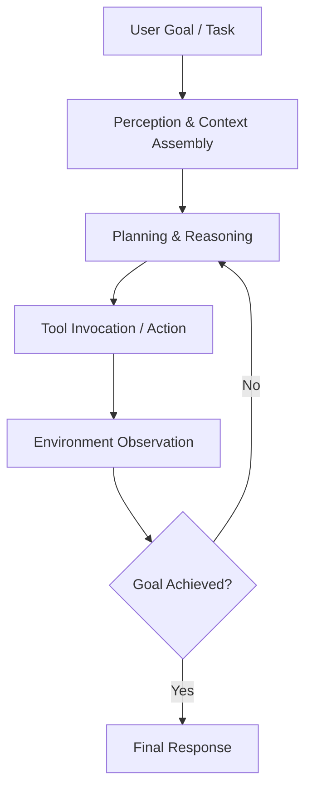

# Autonomous Agent Architecture & Design Patterns

Design guide for building resilient, goal-oriented agentic workflows and tool-augmented LLM systems.

---

## 🏗️ The Agentic Loop

Autonomous agents operate in a continuous feedback loop:

---

## 🔑 Key Architectural Patterns

### 1. ReAct (Reasoning + Acting)
- Interleaves reasoning traces with domain-specific actions (tool calls).
- Allows the agent to self-correct upon tool errors or unexpected environment states.

### 2. Plan-and-Solve
- Separates high-level goal decomposition from step-by-step execution.
- Phase 1: High-level implementation plan creation.
- Phase 2: Sequential step execution with validation milestones.

### 3. Progressive Disclosure (Context Window Optimization)
- Avoid injecting all documentation and tool schemas into every prompt.
- Index skills/tools via short summaries; fetch full context only upon intent matching.

### 4. Human-in-the-Loop & Guardrails
- Critical actions (e.g., destructive shell commands, production deployments, database writes) must trigger approval gates before execution.
